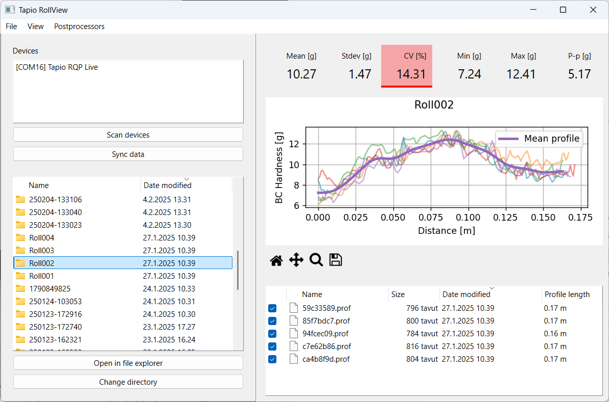

# Tapio RollView

## Overview
Tapio RollView is a viewer and synchronization software for data measured with the Tapio RQP Live roll hardness tester.



### Roll Hardness Measurement with Tapio RQP Live
The hardness profile of a roll is a great overall measure of roll quality. Common roll faults such as bagginess, rope marks, or loose edges are clearly visible in the hardness profile.

The [Tapio RQP Live](https://www.tapiotechnologies.com/tapio-rqp-live/) is an instrument to produce an instant high-resolution hardness profile, showing the measured roll hardness as a function of distance. The measurement is based on measuring the deceleration of an impact hammer hitting the sample over 30 times per second.


## Features
- **Synchronize**: Download data from any connected Tapio RQP Live to the selected working folder
- **View Data**: Plot and display measurement data from the working folder
- **Statistics**: Provide statistics describing the hardness profile quality
- **Alert Limits**: Define limits which will raise warnings if given statistical limits are exceeded
- **Filters**: Apply a band-pass filter on measured profiles to better indicate trends in the measured profile
- **Continuous Mode**: Display the measured profiles as stacked after each other
- **Data Scaling**: Flexible option to display data with different scaling modes
- **Postprocessors**: Automatically convert any synchronized measurement data into any requested format and, for example, send it to mill quality systems
- **Spectrum**: Calculate and display the intensity of periodic variations of the hardness profile at different wavelengths. These frequencies correspond to actuator spacings in the production line.

## Customizations
- **Tailored Export Formats and Postprocessors**: Need a specific data format, for example, an export to a mill system? We can create any custom export to fit your requirements.
- **Additional Features**: Request any additional functionalities.

## Support
For support, training, instruments and customizations please contact us at:
- Email: [info@tapiotechnologies.com](mailto:info@tapiotechnologies.com)
- Visit: [https://www.tapiotechnologies.com](https://www.tapiotechnologies.com)


## Installation instructions

### Standard installation
RollView is released as a Windows executable which does not require separate installation.
- Download the latest release as a Windows executable from the [https://github.com/Tapio-Measurement-Technologies/tapio-rollview/releases](Releases page)

### Custom installation (for configuring custom features)
To install Tapio RollView, follow the steps below:

- [Install Python 3.12.1](https://www.python.org/downloads/release/python-3121/)
- [Install Git](https://git-scm.com/)


Run the following in a command prompt:
```bash
# First navigate to the preferred installation folder
# Clone the repository
git clone https://github.com/Tapio-Measurement-Technologies/tapio-rollview
# Navigate to the project directory
cd tapio-rollview
# Run the installation script (installs python dependencies in a virtualenv, creates local settings, launch script and shortcut)
./install.bat
```


# License
Tapio RollView

Copyright 2024 Tapio Measurement Technologies Oy

Tapio RollView is free software: you can redistribute it and/or modify it under the terms of the GNU General Public License as published by the Free Software Foundation, either version 3 of the License, or (at your option) any later version.

This program is distributed in the hope that it will be useful, but WITHOUT ANY WARRANTY; without even the implied warranty of MERCHANTABILITY or FITNESS FOR A PARTICULAR PURPOSE. See the GNU General Public License for more details.

You should have received a copy of the GNU General Public License along with this program. If not, see [GNU General Public License](https://www.gnu.org/licenses/).

